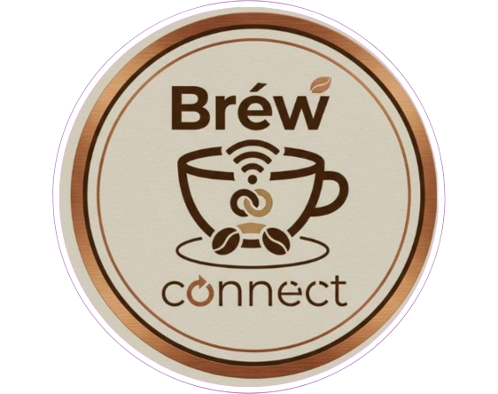

<h1 align="center">☕ Bréw Connect - Full-Stack E-Commerce Application</h1>

<p align="center">
  
</p>

---

Brew Connect is a complete, full-stack e-commerce web application for a fictional coffee brand. It features a modern, responsive user interface and is powered by a custom-built RESTful API to manage products, users, and orders.

**Live Demo:** [https://brewconnect.vercel.app/](https://brewconnect.vercel.app/) 


---

## Features

* **Full-Stack Architecture:** Built with a Node.js/Express backend and a dynamic vanilla JavaScript frontend.
* **Secure User Authentication:** Users can register, log in, and log out. Sessions are managed with JSON Web Tokens (JWT) and passwords are encrypted using `bcrypt.js`.
* **Dynamic Product Catalog:** The menu page fetches and displays all coffee products directly from the backend API.
* **Persistent & Guest Carts:** A logged-in user's cart is saved to their account and persists across devices. Guests can use a cart powered by `localStorage`.
* **Order Placement & History:** Authenticated users can place orders, which are saved to their account. A dedicated profile page allows users to view their complete order history with status tracking.
* **Unique Mood Recommender:** A custom API endpoint filters and suggests coffees based on user-selected moods like "Happy," "Focused," or "Stressed."
* **Simulated Payment Flow:** A complete checkout process with options for "Card" and "Cash on Delivery" that simulates a real transaction and updates order status.
* **Responsive Design:** The entire application is fully responsive and works beautifully on all device sizes.

---

## Tech Stack

| Frontend           | Backend                | Database   |
| ------------------ | ---------------------- | ---------- |
| HTML5              | Node.js                | MongoDB    |
| CSS3 (Flexbox/Grid)| Express.js             | Mongoose   |
| Vanilla JavaScript | JSON Web Tokens (JWT)  |            |
|                    | bcrypt.js              |            |

---

## Local Setup

To run this project locally, you will need to run the frontend and backend servers separately.

### Backend Setup:
1.  Navigate into the `backend` directory:
    ```bash
    cd backend
    ```
2.  Install dependencies:
    ```bash
    npm install
    ```
3.  Create a `.env` file in the `backend` root and add the required variables (`MONGO_URI`, `JWT_SECRET`).
4.  Run the server:
    ```bash
    node server.js
    ```
    The backend will be running on `http://localhost:5000`.

### Frontend Setup:
1.  Open a **new terminal** in the project's main root folder (`Brew-Connect-Full-Stack`).
2.  Open the `index.html` file in your browser. The VS Code "Live Server" extension is recommended for the best experience.

---

## API Endpoints

| Method | Endpoint                    | Description                           | Access    |
| :----- | :-------------------------- | :------------------------------------ | :-------- |
| `GET`  | `/api/products`             | Get all products                      | Public    |
| `GET`  | `/api/products/mood/:mood`  | Get products filtered by mood tag     | Public    |
| `POST` | `/api/users/register`       | Register a new user                   | Public    |
| `POST` | `/api/users/login`          | Authenticate a user and get a token   | Public    |
| `GET`  | `/api/cart`                 | Get the logged-in user's cart         | Private   |
| `POST` | `/api/cart`                 | Add an item to the user's cart        | Private   |
| `POST` | `/api/orders`               | Create a new order                    | Private   |
| `GET`  | `/api/orders/myorders`      | Get all orders for the logged-in user | Private   |

---

## License 

This project is open-source and free to use for educational purposes.